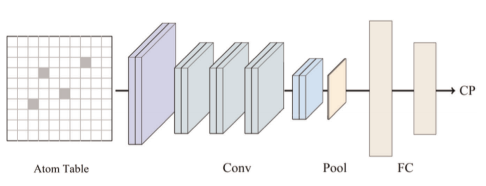

# cnn_molecular_discovery
An unsupervised CNN based architecture for molecular discovery.

In this work, we combine the approaches of two methods: [Atom2Vec](https://www.pnas.org/content/115/28/E6411) and [Atom Table CNNs](https://www.nature.com/articles/s41524-019-0223-y) to get SOTA resuts in the Supercon dataset for critical temperature evaluation.

The network architecture is given below:



### Installation

```
pip install -r requirements.txt
```

To reproduce the results, run the code provided in the corresponding jupyter-notebook.

### Methodlogy used
The report for the methodolgy used and the corresponding results is given in [report](./ML_in_NS_Report.pdf).

### Contributors
- [Shashank Srikanth](https://github.com/talsperre)
- [Utkarsh Azad](https://github.com/obliviateandsurrender)